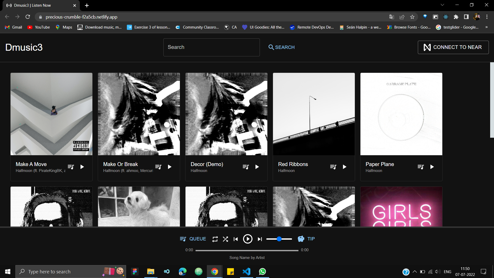

## Problem
Artists should have ownership of their music and be able to freely trade their ownership of their music.

Listeners should be able to listen to high-quality music and be able to directly support their favorite artists.

Today Web2 Apps own all user data

## Solution
Artists can upload their music as an NFT which gives them ownership of their music

Which then can be freely traded on any NFT marketplace

They can also attach royalties to their music so that when ownership of the song is traded between owners, they get a portion of the revenue

Music is also uploaded as lossless .wav files thanks to IPFS and Filecoin providing a safe and easy way to store large files.

This allows listeners to have access to the original audio that the artist intended for them to hear. The platform also supports tipping your favorite artists with NEAR tokens, so listeners support their favorite artists directly.

## Why Login With Integrated  Unstoppable Domain
Login to different apps and websites with just your Unstoppable domain and say goodbye to user accounts and passwords.

Unstoppable Domain allows you to create a blockchain-connected email address similar to a URL — such as Samplename. crypto or Samplename. zil for example — that translates a cryptocurrency wallet's addresses into a far simpler human-readable name that connects with decentralized apps (dApps) and exchanges.

## How It's Built
There are two parts to the applications. The frontend was built using [NextJS](https://nextjs.org/) to support a faster and easier development workflow.  The backend was obviously built using [NEAR protocol](https://near.org/) and I did not require any 3rd party backend.

The frontend was built using NextJS to support a faster and easier development workflow. The backend was  built using NEAR protocol .The login integration is done by unstopabble domains

## Link to app
https://precious-crumble-f2a5cb.netlify.app/

## Code For Login Unstopable Domain

### [/context/NearProvider.js](https://github.com/ykute07/Unstoppable_Integration/blob/master/pages/home.js)
~~~js
const uauth = new UAuth(
      {
        clientID: "<Enter your client id>",
        redirectUri: <Enter your direct url>",
        scope: "openid wallet email:optional humanity_check:optional"
      })
~~~

### [/context/NearProvider.js](https://github.com/ykute07/Unstoppable_Integration/blob/master/pages/home.js)
~~~js
const handleLogin = async() => {
      setLoading(true)
      await uauth
        .loginWithPopup()
        .then(() => uauth.user().then(setUser))
        .catch((e)=>{console.log(e)})
        .finally(() => {setRedirect(false)})
        if(user){
          setRedirect(false);
          router.push("/")
        }
    }
~~~

## We Want To Thank unstoppabel domain for organinzing Digital Identity Hack Asia - 2022 event
